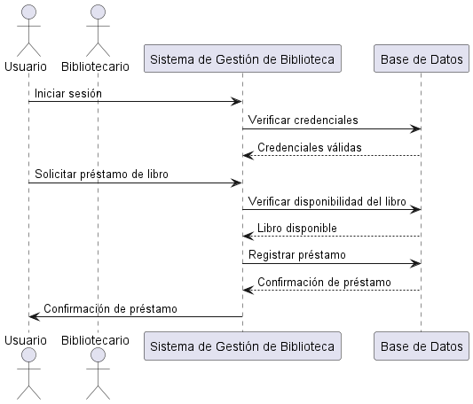
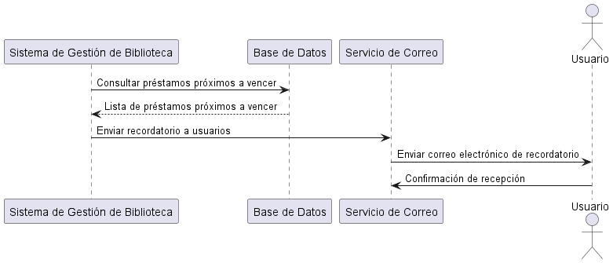
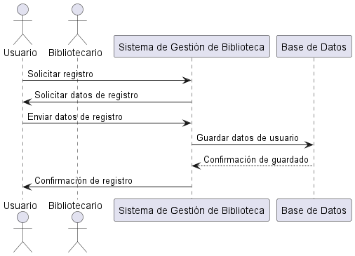
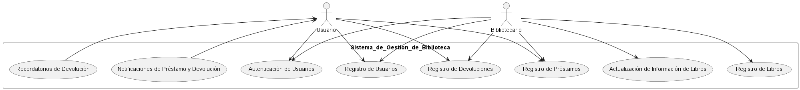

**Proyecto:Sistema de gestion de una bliblioteca**

- Descripcion: El Sistema de Gestión de Biblioteca es una aplicación destinada a administrar las operaciones diarias de una biblioteca, incluyendo el manejo de libros, usuarios, préstamos y devoluciones. El objetivo principal es facilitar la gestión eficiente de la biblioteca, mejorar la experiencia de los usuarios y mantener un registro preciso de todas las transacciones.

**Requeriminetos funcionales**

1. Gestión de Usuarios
- Registro de Usuarios: El sistema debe permitir el registro de nuevos usuarios con información como nombre, dirección, número de teléfono y correo electrónico.

- Autenticación de Usuarios: Los usuarios deben poder iniciar sesión en el sistema con un nombre de usuario y una contraseña.

2. Gestión de Libros
- Registro de Libros: El sistema debe permitir la adición de nuevos libros con detalles como título, autor, ISBN, editorial, año de publicación y categoría.

- Actualización de Información de Libros: Los bibliotecarios deben poder actualizar la información de los libros existentes.

3. Préstamos y Devoluciones
- Registro de Préstamos: El sistema debe registrar los préstamos de libros, incluyendo la información del usuario, la fecha de préstamo y la fecha de devolución prevista.

- Registro de Devoluciones: El sistema debe registrar la devolución de libros, actualizando el estado del libro y verificando si hay multas por retraso.

4.  Notificaciones y Recordatorios
- Notificaciones de Préstamo y Devolución: El sistema debe enviar notificaciones por correo electrónico o mensaje de texto a los usuarios cuando realizan un préstamo o una devolución.

- Recordatorios de Devolución: El sistema debe enviar recordatorios automáticos a los usuarios sobre la fecha de devolución próxima para evitar multas.

**TRELLO LINK**
**https://trello.com/b/p9vrVOW7/sistema-de-gestion-de-una-bliblioteca**

**Diagrama de clases**

**Descripción del Diagrama:**

- Clases:

- Usuario: Representa a los usuarios de la biblioteca con atributos como nombre, dirección, teléfono, email, nombre de usuario y contraseña. Métodos incluidos: registrar() y autenticar().

- Bibliotecario: Representa a los bibliotecarios con atributos como nombre, nombre de usuario y contraseña. Métodos incluidos: autenticar().

- Libro: Representa los libros en la biblioteca con atributos como título, autor, ISBN, editorial, año de publicación y categoría. Métodos incluidos: registrar() y actualizar().

- Prestamo: Representa los préstamos de libros con atributos como fecha de préstamo, fecha de devolución prevista, fecha de devolución real y multa. Métodos incluidos: registrar() y registrarDevolucion().

- Notificacion: Representa las notificaciones enviadas a los usuarios con atributos como tipo, mensaje y fecha de envío. Métodos incluidos: enviar().

- Recordatorio: Representa los recordatorios enviados a los usuarios con atributos como mensaje y fecha de envío. Métodos incluidos: enviar().

**Relaciones:**

- Un Usuario puede realizar múltiples Préstamos.
- Un Libro puede estar asociado a múltiples Préstamos.
- Un Bibliotecario puede gestionar múltiples Préstamos y Libros.
- Un Préstamo puede generar múltiples Notificaciones y Recordatorios.

**Diagrama de secuencia**

**Descripcion del diagrama**

- Estos diagramas de secuencia detallan el flujo de interacción entre los actores (usuarios y bibliotecarios), el sistema de gestión de la biblioteca y otros componentes como la base de datos y el servicio de correo electrónico. Puedes ajustar y expandir estos diagramas según las necesidades específicas de tu proyecto y los casos de uso adicionales que desees incluir.

**Diagrama de casos de uso**

**Descripción del Diagrama**

- Actores

- Usuario: Persona que utiliza la biblioteca para prestar y devolver libros.
- Bibliotecario: Persona encargada de la gestión administrativa de la biblioteca.

- Casos de Uso:

- Registro de Usuarios (RU): Permite registrar nuevos usuarios.
- Autenticación de Usuarios (AU): Permite a los usuarios iniciar sesión en el sistema.
- Registro de Libros (RL): Permite la adición de nuevos libros al sistema.
- Actualización de Información de Libros (AIL): Permite actualizar la información de los libros existentes.
- Registro de Préstamos (RP): Permite registrar el préstamo de libros.
- Registro de Devoluciones (RD): Permite registrar la devolución de libros y verificar multas.
- Notificaciones de Préstamo y Devolución (NPD): Envía notificaciones a los usuarios cuando realizan un préstamo o una devolución.
- Recordatorios de Devolución (RDV): Envía recordatorios automáticos a los usuarios sobre la fecha de devolución próxima.